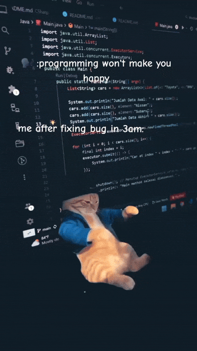

# Hi 👋 I'm Mehedi Hasan Raju

### Full Stack MERN Developer | CSE Student | Open to Software Engineering Internship

<p align="left">
  
</p>


## 👨‍💻 About Me

- 🎓 Final Year B.Sc. in Computer Science & Engineering
- 💻 Passionate Full Stack MERN Developer
- 🌱 Currently learning **Next.js, PostgreSQL & Docker**
- 🚀 Building scalable and responsive web applications
- 🤝 Open to Internship & Open Source Collaboration
- 💬 Ask me about **React, Node.js, Express, MongoDB & TypeScript**
- 📧 **Email:** mehedihasanraju727@outlook.com
- **My Portfolio:** https://mehedi-hasan-raju.netlify.app/

---

## 🌐 Connect With Me

<p align="left">
<a href="https://github.com/Mehedi-Hasan-Raju">

</a>

<a href="https://www.linkedin.com/in/mehedi-hasan-raju">

</a>

<a href="mailto:mehedihasanraju727@outlook.com">

</a>

</p>

---

## 💻 Tech Stack

<p>


</p>

---

## ⏱️ Weekly Coding Stats

<!--START_SECTION:waka-->

```txt
Total Time: 6 hrs 33 mins

TypeScript   3 hrs 4 mins          ███████████▓░░░░░░░░░░░░░   46.77 %
Prisma       1 hr 41 mins          ██████▒░░░░░░░░░░░░░░░░░░   25.73 %
JavaScript   52 mins               ███▒░░░░░░░░░░░░░░░░░░░░░   13.45 %
Bash         25 mins               █▓░░░░░░░░░░░░░░░░░░░░░░░   06.39 %
Git Config   12 mins               ▓░░░░░░░░░░░░░░░░░░░░░░░░   03.24 %
```

<!--END_SECTION:waka-->

---

## 📈 Contribution Graph

<p align="center">
  
</p>

---
## 🐍 Contribution 

<p align="center">
  
</p>
---

<p align="center">
  
</p>

---
## 🚀 Featured Projects

| Project | Description | Tech |
|----------|-------------|------|
| 🏨 Hotel Booking Platform | Full Stack Hotel Booking Website | MERN |
| 💼 Job Portal & Gig Finder | Job Search & Recruitment Platform | MERN |
| ⚡ Raw Node.js REST API | REST API with TypeScript | Node.js |
| 🏠 React weather app | weather information | React |

---

## 📚 Currently Learning

- Next.js
- PostgreSQL
- Docker
- System Design

---

## 🎯 2026 Goals

- 🚀 Software Engineering Internship
- 🌍 Open Source Contributions
- ⭐ Build Production Ready Applications
- ☁️ Learn AWS & Cloud Deployment

---

## ⚡ Fun Fact

> I enjoy solving real-world problems by building scalable and user-friendly web applications.

---

<p align="center">

### ⭐ Thanks for visiting my profile!

If you like my work, don't forget to ⭐ my repositories.

</p>
